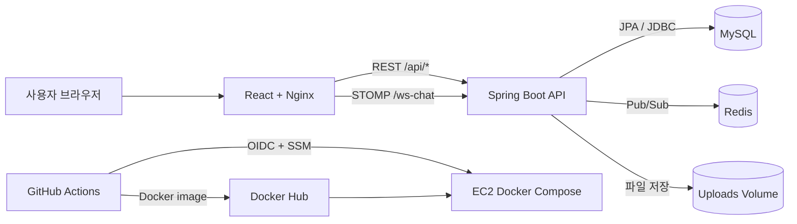
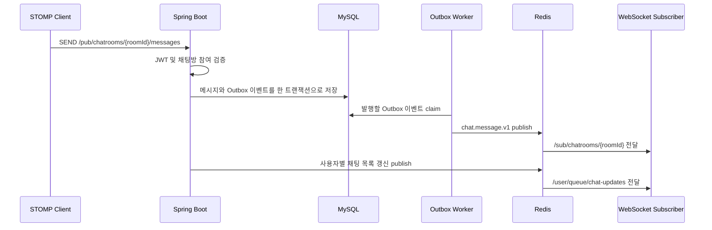
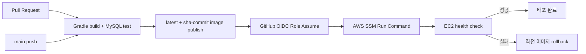

# HobbyLoop Backend

> 취미로 이어지는 커뮤니티, 하비루프

HobbyLoop Backend는 취미를 게시하고 다른 사용자와 소통할 수 있는 하비루프 서비스의 API 서버입니다. 회원, 게시글, 댓글, 좋아요, 조회수, 이미지 업로드, JWT 인증, 1:1 실시간 채팅까지의 서비스와 비즈니스 로직을 가집니다.

## 목차

- [주요 기능](#주요-기능)
- [서비스 구조](#서비스-구조)
- [프로젝트 구조](#프로젝트-구조)
- [기술 스택](#기술-스택)
- [시작하기](#시작하기)
- [환경변수](#환경변수)
- [API 명세](#api-명세)
- [WebSocket과 실시간 채팅](#websocket과-실시간-채팅)
- [테스트](#테스트)
- [Docker와 배포](#docker와-배포)

## 주요 기능

- **회원과 인증**: 이메일 회원가입, 로그인, 로그아웃, JWT access token 갱신, 회원정보·비밀번호 변경
- **취미 피드**: 게시글 무한스크롤 목록과 상세 조회, 작성·수정·삭제, 임시 저장
- **커뮤니티 반응**: 댓글과 대댓글, 좋아요, 조회수, 게시글 신고
- **이미지**: 프로필 이미지와 게시글 본문 이미지 업로드
- **1:1 채팅**: 채팅방 생성·재입장·퇴장, 메시지 이력, 읽음 상태, 안 읽은 메시지 수
- **실시간 전달**: JWT로 인증한 STOMP 연결, Redis Pub/Sub, Transactional Outbox 기반 메시지 전달

## 서비스 구조



### 채팅 메시지 전달 흐름



## 프로젝트 구조

```text
src/main/java/com/example/spring_rest_api
├── article        # 게시글, 임시 저장, 신고
├── authorization  # 로그인, JWT, refresh token
├── chat           # 채팅방, 메시지, STOMP, Redis, Outbox
├── comment        # 댓글과 대댓글
├── common         # 보안, WebSocket, Redis, 예외, 공통 응답
├── image          # 이미지 업로드와 파일 경로
├── like           # 게시글 좋아요
├── user           # 회원 정보와 계정 상태
└── view           # 게시글 조회수
```

도메인은 `controller → service → repository → entity` 방향으로 구성하며 요청·응답 DTO는 각 도메인의 `service/request`, `service/response`에 둡니다. 채팅의 비동기 전달 코드는 `chat/outbox`, `chat/service/publisher`, `chat/service/subscriber`로 분리되어 있습니다.

## 기술 스택

| 구분 | 기술 | 역할 |
|---|---|---|
| Language | Java 21 | 애플리케이션 구현 |
| Framework | Spring Boot 3.5.15 | REST API와 애플리케이션 구성 |
| Security | Spring Security, JJWT | Bearer JWT 인증과 비밀번호 암호화 |
| Persistence | Spring Data JPA, JDBC | 도메인 영속화와 Outbox claim 처리 |
| Database | MySQL 8.4, H2 | 운영·CI 데이터베이스와 로컬·테스트 데이터베이스 |
| Realtime | WebSocket, STOMP | 채팅 메시지와 읽음 이벤트 전달 |
| Messaging | Redis Pub/Sub | 여러 서버 인스턴스 사이의 채팅 이벤트 전달 |
| Reliability | Transactional Outbox, Spring Retry | DB 저장과 비동기 발행 사이의 전달 안정성 보완 |
| Build/Test | Gradle Wrapper, JUnit 5 | 재현 가능한 빌드와 자동 테스트 |
| Runtime | Docker, Docker Compose, Nginx | 컨테이너 빌드와 서비스 실행 |
| CI/CD | GitHub Actions, Docker Hub, AWS OIDC·SSM | 검증, 이미지 발행, EC2 배포 |

## 시작하기

### 준비물

- Java 21
- Docker와 Docker Compose Plugin
- Redis
- 환경에 맞는 H2 또는 MySQL 스키마

### 1. 저장소 준비

```bash
git clone https://github.com/100-hours-a-week/KTB4_Jayden_Week12_BE.git
cd KTB4_Jayden_Week12_BE
chmod +x gradlew
```

### 2. Redis 실행

로컬 프로필은 기본적으로 `127.0.0.1:6379`의 비밀번호 없는 Redis를 사용합니다.

```bash
docker run --name hobbyloop-redis -p 6379:6379 -d redis:7-alpine
```

### 3. 로컬 실행

기본 프로필은 `local`입니다. JWT secret을 환경변수로 전달한 뒤 실행합니다.

```bash
JWT_SECRET='replace-with-a-long-random-secret' ./gradlew bootRun
```

서버는 기본적으로 `http://localhost:8080`에서 실행되고 H2 Console은 `http://localhost:8080/h2-console`에 열립니다.

> **스키마 준비 필요**  
> `application-local.yaml`은 `jdbc:h2:~/test`와 `spring.jpa.hibernate.ddl-auto: none`을 사용합니다. 현재 메인 리소스에는 로컬 DB를 자동 초기화하는 운영용 스키마가 없으므로, 새 환경에서는 애플리케이션 API를 호출하기 전에 현재 엔티티와 일치하는 스키마를 별도로 준비해야 합니다. `src/test/resources/schema-h2.sql`과 `schema-mysql.sql`은 자동 테스트 전용입니다.

### 4. 빌드

```bash
./gradlew clean build --no-daemon
```

빌드 산출물은 `build/libs/`에 생성됩니다.

## 환경변수

운영 설정은 루트의 `.env.example`을 복사해 준비합니다.

```bash
cp .env.example .env.prod
```

`.env.prod`는 Git에 커밋하지 않습니다. 비밀번호, JWT secret, Docker Hub token 같은 비밀값은 예시 파일이나 workflow에 직접 명시하지 않습니다.

| 변수 | 필수 환경 | 설명 | 예시/기본값 |
|---|---|---|---|
| `SPRING_PROFILES_ACTIVE` | 운영 | 활성 Spring profile | `prod` |
| `DB_URL` | 운영 | 외부 MySQL JDBC URL | `jdbc:mysql://db.example:3306/hobbyloop` |
| `DB_USERNAME` | 운영 | DB 사용자 | 직접 설정 |
| `DB_PASSWORD` | 운영 | DB 비밀번호 | Secret으로 설정 |
| `DB_POOL_MAX_SIZE` | 운영 | Hikari 최대 연결 수 | `10` |
| `DB_POOL_MIN_IDLE` | 운영 | Hikari 최소 유휴 연결 수 | `2` |
| `REDIS_HOST` | 운영 | Redis 호스트 | 직접 설정 |
| `REDIS_PORT` | 운영 | Redis 포트 | `6379` |
| `REDIS_PASSWORD` | 운영 | Redis 비밀번호 | Secret으로 설정 |
| `REDIS_SSL_ENABLED` | 운영 | Redis TLS 사용 여부 | `false` |
| `JWT_SECRET` | 전체 | JWT 서명 키 | 충분히 긴 무작위 값 |
| `JWT_ACCESS_TOKEN_EXPIRATION` | 운영 | access token 만료 시간(초) | `180` |
| `JWT_REFRESH_TOKEN_EXPIRATION` | 운영 | refresh token 만료 시간(초) | `12096000` |
| `UPLOAD_PATH` | 운영 | 업로드 파일 저장 경로 | `/var/lib/hobbyloop/uploads` |
| `CORS_ALLOWED_ORIGINS` | 운영 설정용 | 허용할 프런트엔드 origin | `https://example.com` |
| `SERVER_PORT` | 운영 | Spring Boot 포트 | `8080` |
| `SERVER_ADDRESS` | 운영 | 서버 bind 주소 | `0.0.0.0` |
| `HTTP_PORT` | Compose | Nginx 호스트 포트 | `80` |
| `VITE_API_BASE_URL` | 개발 Compose | 프런트엔드 API base URL | `/api` |

## API 명세

Nginx를 통과할 때는 `/api`가 제거되어 Spring Boot로 전달됩니다.

### 인증과 상태 코드

인증된 API는 다음 헤더를 사용합니다.

```http
Authorization: Bearer <accessToken>
```

로그인과 토큰 갱신 과정의 refresh token은 `HttpOnly`, `SameSite=Strict`, `Path=/` 쿠키로 전달됩니다.

주요 상태 코드는 `200 OK`, `201 Created`, `204 No Content`, `400 Bad Request`, `401 Unauthorized`, `403 Forbidden`, `404 Not Found`, `413 Payload Too Large`, `500 Internal Server Error`입니다.

아래 표에서 **공개**는 Spring Security 설정상 Bearer token 없이 접근 가능한 경로입니다. 그 외 경로는 인증이 필요합니다.

### 회원과 인증

| Method | Path | 인증 | 설명 |
|---|---|---|---|
| `POST` | `/users` | 공개 | 회원가입 |
| `POST` | `/auth/login` | 공개 | 로그인 |
| `POST` | `/auth/token/refresh` | 공개 | access token 갱신 |
| `POST` | `/auth/logout` | 공개 | refresh token 폐기 |
| `GET` | `/users/me` | 필요 | 내 정보 조회 |
| `PATCH` | `/users/me` | 필요 | 닉네임·프로필 변경 |
| `PATCH` | `/users/me/password` | 필요 | 비밀번호 변경 |
| `DELETE` | `/users/me` | 필요 | 회원 탈퇴 |

### 게시글

| Method | Path | 인증 | 설명 |
|---|---|---|---|
| `POST` | `/articles` | 필요 | 게시글 작성 |
| `PUT` | `/articles/{articleId}` | 필요 | 게시글 수정 |
| `DELETE` | `/articles/{articleId}` | 필요 | 게시글 삭제 |
| `GET` | `/articles/{articleId}` | 필요 | 게시글 상세 조회 |
| `GET` | `/articles?pageSize={size}&lastArticleId={cursor}` | 필요 | 게시글 커서 목록 |
| `PUT` | `/articles/temp-save` | 필요 | 임시 저장 |
| `GET` | `/articles/temp-save` | 필요 | 임시 저장 조회 |
| `POST` | `/articles/{articleId}/report` | 필요 | 게시글 신고 |

### 댓글, 좋아요와 조회수

| Method | Path | 인증 | 설명 |
|---|---|---|---|
| `POST` | `/articles/{articleId}/comments` | 필요 | 댓글·대댓글 작성 |
| `PUT` | `/articles/{articleId}/comments/{commentId}` | 필요 | 댓글 수정 |
| `DELETE` | `/articles/{articleId}/comments/{commentId}` | 필요 | 댓글 삭제 |
| `GET` | `/articles/{articleId}/comments/{commentId}` | 필요 | 댓글 단건 조회 |
| `GET` | `/articles/{articleId}/comments?pageSize={size}&lastParentCommentId={id}&lastCommentId={id}` | 필요 | 댓글 커서 목록 |
| `GET` | `/articles/{articleId}/comments/count` | 필요 | 댓글 수 조회 |
| `POST` | `/likes/articles/{articleId}` | 필요 | 좋아요 |
| `DELETE` | `/likes/articles/{articleId}` | 필요 | 좋아요 취소 |
| `GET` | `/likes/articles/{articleId}/count` | 필요 | 좋아요 수 조회 |
| `POST` | `/views/articles/{articleId}` | 필요 | 조회수 증가 |
| `GET` | `/views/articles/{articleId}/count` | 필요 | 조회수 조회 |

### 이미지

| Method | Path | 인증 | 설명 |
|---|---|---|---|
| `POST` | `/users/me/profile-image` | 공개 | 프로필 이미지 업로드 |
| `POST` | `/articles/content-image` | 필요 | 게시글 이미지 업로드 |
| `GET` | `/public/**` | 공개 | 업로드 파일 조회 |

이미지 제한은 파일당 10MB, 요청 전체 100MB입니다.

### 채팅 REST API

| Method | Path | 인증 | 설명 |
|---|---|---|---|
| `POST` | `/chatrooms/direct` | 필요 | 1:1 채팅방 생성·조회 |
| `GET` | `/chatrooms/{roomId}` | 필요 | 채팅방 정보 조회 |
| `GET` | `/chatrooms?createdAtCursor={time}&lastMessageId={id}&pageSize={size}` | 필요 | 채팅방 커서 목록 |
| `GET` | `/chatrooms/{roomId}/messages?lastMessageId={id}&pageSize={size}` | 필요 | 이전 메시지 조회 |
| `GET` | `/chatrooms/unread-count` | 필요 | 전체 안 읽은 메시지 수 |
| `DELETE` | `/chatrooms/{roomId}/users/me` | 필요 | 채팅방 퇴장 |

## WebSocket과 실시간 채팅

| 구분 | 값 |
|---|---|
| Handshake endpoint | `ws(s)://{host}/ws-chat` |
| 클라이언트 publish prefix | `/pub` |
| broker prefix | `/sub`, `/queue` |
| 사용자 destination prefix | `/user` |

### 1. 연결

STOMP `CONNECT` frame의 native header에 access token을 전달합니다.

```text
Authorization: Bearer <accessToken>
```

토큰이 없거나 유효하지 않으면 연결이 거부됩니다. 연결 후에도 모든 `SEND`와 `SUBSCRIBE`에서 세션 토큰 만료 여부를 검사합니다.

### 2. 구독

| Destination | 용도 |
|---|---|
| `/sub/chatrooms/{roomId}` | 현재 채팅방 실시간 갱신 |
| `/user/queue/chat-updates` | 채팅 목록·안 읽은 수 갱신 |
| `/user/queue/auth` | 재인증 결과 수신 |
| `/user/queue/chat-errors` | 사용자별 채팅 오류 수신 |


### 3. 메시지 전송

클라이언트가 발행하는 destination은 다음과 같습니다.

| Destination | 용도 |
|---|---|
| `/pub/chatrooms/{roomId}/messages` | 텍스트 메시지 전송 |
| `/pub/chatrooms/{roomId}/read` | 마지막으로 읽은 메시지 갱신 |
| `/pub/auth/reauth` | access token 재인증 |

### 4. 읽음 처리

클라이언트가 마지막으로 확인한 메시지를 서버에 알리면 같은 채팅방의 구독자에게 읽음 상태가 전달됩니다.

### 5. access token 재인증

연결 사용자가 바뀌지 않는 범위에서 WebSocket 연결을 끊지 않고 token을 교체할 수 있습니다.
새 access token은 `/pub/auth/reauth`로 전달하며 결과는 `/user/queue/auth`에서 확인합니다.

## 테스트

### 기본 테스트

```bash
./gradlew test
```

테스트 리소스의 기본 profile은 `test,test-h2`입니다. 인메모리 H2를 MySQL 호환 모드로 실행하고 `schema-h2.sql`로 스키마를 초기화합니다.

### MySQL 통합 환경

CI와 동일하게 MySQL 8.4를 준비하고 다음 변수를 설정합니다.

```bash
SPRING_PROFILES_ACTIVE='test,test-mysql' \
TEST_DB_URL='jdbc:mysql://127.0.0.1:3306/hobbyloop_test?useSSL=false&allowPublicKeyRetrieval=true&serverTimezone=Asia/Seoul' \
TEST_DB_USERNAME='test_user' \
TEST_DB_PASSWORD='test_password' \
./gradlew clean build --no-daemon
```

MySQL profile은 `src/test/resources/schema-mysql.sql`을 사용합니다.

## Docker와 배포

### 개발 Compose

루트 `docker-compose.yaml`은 백엔드를 현재 소스에서 빌드하고, 형제 경로 `../community-ktb`의 프론트엔드와 함께 빌드합니다.

선행 조건:

- `../community-ktb` 프런트엔드 저장소
- 유효한 `.env.prod`
- 외부 MySQL과 Redis
- 현재 애플리케이션과 일치하는 DB 스키마

```bash
docker compose --env-file .env.prod config --quiet
docker compose --env-file .env.prod up --build -d
```

Nginx만 `${HTTP_PORT:-80}`으로 노출되고 백엔드 8080 포트는 Compose 네트워크 내부에서 사용됩니다.

### 운영 Compose

운영 서버는 로컬 빌드 대신 Docker Hub 이미지를 받습니다.

```bash
docker compose --env-file .env.prod -f docker-compose.prod.yaml config --quiet
docker compose --env-file .env.prod -f docker-compose.prod.yaml up -d
```

기본 이미지는 `hobbyloop-backend:latest`와 `hobbyloop-frontend:latest`이며, 배포 시에는 `BACKEND_IMAGE` 또는 `FRONTEND_IMAGE`로 불변 SHA 태그를 주입합니다.

### CI/CD 흐름



- Pull Request는 검증만 수행합니다.
- `main` push는 검증 후 Docker Hub에 `latest`와 `sha-${commit}` 이미지를 발행합니다.
- deploy job은 GitHub OIDC로 AWS Role을 Assume하고 SSM을 통해 EC2의 `deploy-service.sh`를 실행합니다.
- 배포 스크립트는 `flock`으로 동시 배포를 막고 새 컨테이너의 health를 확인합니다. 실패 시 직전 로컬 이미지로 롤백합니다.
- EC2에는 Docker Compose, AWS CLI, `flock`, `/opt/hobbyloop/.env.prod`와 Docker Hub pull 전용 SSM SecureString이 필요합니다.
